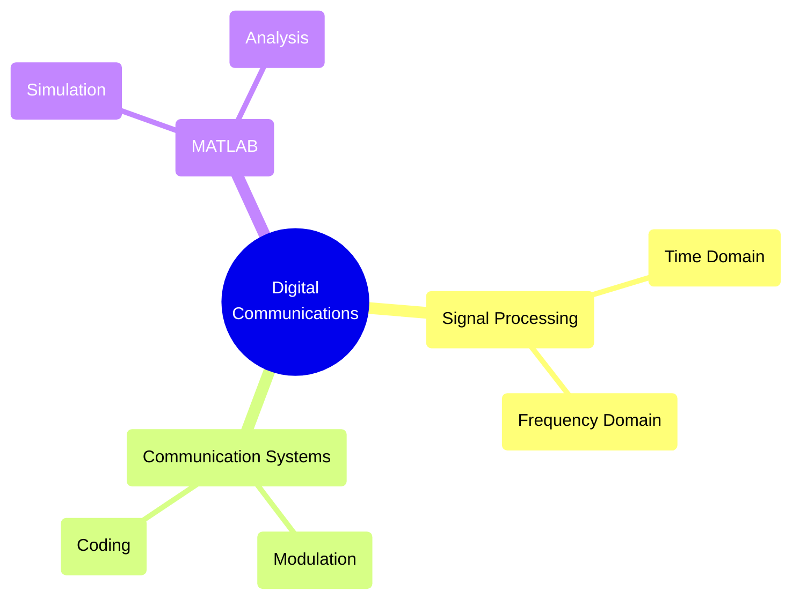
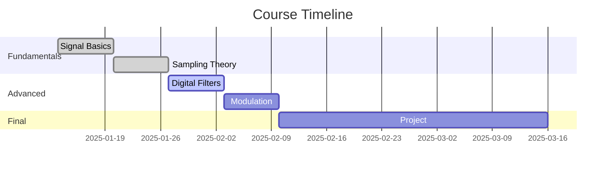
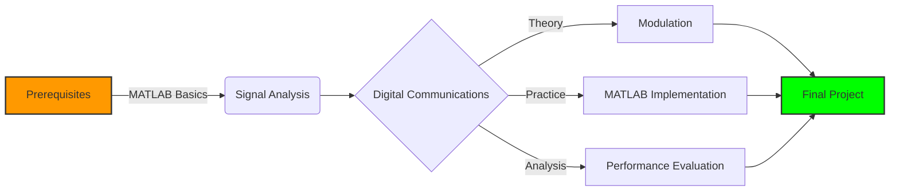

# Digital Communications Laboratory ⚡

<div align="center">

<!-- Stunning 3D Banner with Animation -->


<!-- Animated Visitor Badge -->


<!-- Dynamic Project Stats -->
<p align="center">


</p>

<!-- Animated Tech Stack -->

<p align="center">

</p>

<!-- Cool Waves Animation -->
<picture>
  <source media="(prefers-color-scheme: dark)" srcset="https://raw.githubusercontent.com/platane/platane/output/github-contribution-grid-snake-dark.svg">
  <source media="(prefers-color-scheme: light)" srcset="https://raw.githubusercontent.com/platane/platane/output/github-contribution-grid-snake.svg">
  
</picture>

</div>

<!-- Fancy Section Divider -->


## 🎓 Course Overview

<div align="center">
<table>
<tr>
<td width="50%">

### 📚 DTEK2073

University of Turku's premier course in digital communications and signal processing.

**Course Duration:** 13.01.2025 - 16.03.2025  
**Credits:** 5 ECTS  
**Level:** Intermediate Studies

</td>
<td width="50%">

### 🎯 Learning Focus



</td>
</tr>
</table>
</div>

<!-- Animated Progress Tracker -->

## 📊 Course Progress



## 💻 Repository Highlights

<!-- Fancy Repository Structure -->
<details>
<summary>📂 Click to View Project Structure</summary>

```ascii
📦 DigitalCommunications
 ┣ 📂 Exercise1
 ┃ ┣ 🔷 Task1.m - Signal Generation
 ┃ ┣ 🔷 Task2.m - FFT Analysis
 ┃ ┗ 🔷 Task3.m - Filter Design
 ┣ 📂 Exercise2
 ┃ ┣ 🔷 Task1.m - Modulation
 ┃ ┣ 🔷 Task2.m - Demodulation
 ┃ ┗ 🔷 Task3.m - Performance
 ┣ 📂 Exercise3
 ┃ ┣ 🔷 Task1.m - Channel Coding
 ┃ ┣ 🔷 Task2.m - Error Analysis
 ┃ ┗ 🔷 Task3.m - System Design
 ┣ 📜 README.md
 ┗ 📜 .gitignore
```

</details>

## 🚀 Key Features

<div align="center">
<table>
<tr>
<td width="33%">
<h3 align="center">Signal Processing 📊</h3>

```matlab
% FFT Analysis Example
Fs = 1000;
t = 0:1/Fs:1-1/Fs;
x = sin(2*pi*50*t);
y = fft(x);
```

</td>
<td width="33%">
<h3 align="center">Digital Filters 🔧</h3>

```matlab
% FIR Filter Design
N = 50;
Fc = 0.25;
b = fir1(N, Fc);
freqz(b, 1);
```

</td>
<td width="33%">
<h3 align="center">Modulation 📡</h3>

```matlab
% QPSK Modulation
M = 4;
data = randi([0 M-1], 1000, 1);
txSig = pskmod(data, M);
```

</td>
</tr>
</table>
</div>

## 📈 Learning Path

<!-- Interactive Course Map -->



## ⚡ Quick Start Guide

<div align="center">

### Installation Steps


</div>

```bash
# Clone this amazing repository
git clone https://github.com/rikulauttia/DigitalCommunications.git

# Navigate to the project
cd DigitalCommunications

# Start your MATLAB journey
matlab -nosplash -nodesktop -r "run('Exercise1/Task1.m')"
```

## 📚 Course Components

<!-- Animated Stats -->
<div align="center">
<table>
<tr>
<td align="center" width="25%">

<br>
<strong>28h</strong>
<br>
Lectures
</td>
<td align="center" width="25%">

<br>
<strong>21h</strong>
<br>
Lab Work
</td>
<td align="center" width="25%">

<br>
<strong>36h</strong>
<br>
Assignments
</td>
<td align="center" width="25%">

<br>
<strong>50h</strong>
<br>
Self-Study
</td>
</tr>
</table>
</div>

## 🛠️ Technical Requirements

<div align="center">
<table>
<tr>
<td>

### Software

- MATLAB R2022b+
- Signal Processing Toolbox
- Communications Toolbox
- Git (for version control)

</td>
<td>

### Hardware

- Modern CPU (i5/Ryzen 5 or better)
- 8GB RAM minimum
- 10GB free disk space
- Dedicated GPU (optional)

</td>
</tr>
</table>
</div>

## 🤝 Connect & Contribute

<div align="center">

<!-- Professional Contact Badges -->

[](https://linkedin.com/in/rikulauttia)
[](https://github.com/rikulauttia)
[](https://rikulauttia.com)

</div>

## 📝 License

<div align="center">

This project is licensed under the MIT License - see the [LICENSE](LICENSE) file for details.

<!-- Animated Footer -->


### Made with 💙 by Riku Lauttia

University of Turku | 2025

</div>
